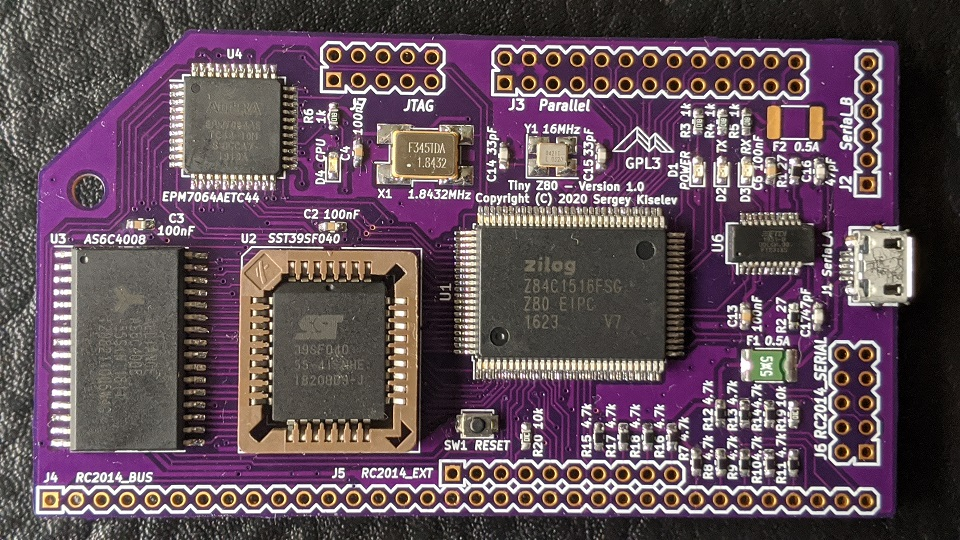

# Tiny Z80
Business Card Sized Zilog Z80 Single Board Computer

## Table of Content
* [Introduction](#introduction)
* [Specifications](#specifications)
* [Hardware Documentation](#hardware-documentation)
  * [Schematic and PCB Layout](#schematic-and-pcb-layout)
  * [Connectors and Jumpers](#connectors-and-jumpers)
  * [Bill of Materials](#bill-of-materials)
* [Firmware Documentation](#firmware-documentation)
  * [BIOS and OS](#bios-and-os)
  * [SPLD Fuse Map](#spld-fuse-map)
* [Release Notes](#release-notes)
  * [Changes](#changes)
  * [Known Issues](#known-issues)
  * [Wishlist](#wishlist)

## Introduction
Tiny Z80 is a business card sized (size?!) single board computer (SBC). It is mostly compatible with [Easy Z80](https://github.com/skiselev/easy_z80), and offers similar capabilities, including 512 KiB of battery-backed SRAM, 512 KiB Flash ROM, Z80 SIO and Z80 CTC (integrated in Z80 EIPC). Tiny Z80 includes a USB to Serial converter IC on board connected to one of the SIO ports, for ease of use with modern computers. The glue logic, including the memory paging registers is implemented using Altera MAX7000AE CPLD.

## Specifications
* Processor: Zilog Z80 EIPC - Z84C15, includes Z80 CPU, Z80 SIO, Z80 PIO, and Z80 CTC
* Memory: 512 KiB battery-backed SRAM, 512 KiB Flash ROM
* Input/Output:
  * Dual RS232 serial ports, implemented using Z80 SIO integrated into Z80 EIPC
  * FT231XS USB to Serial converter connected to SIO Port A
  * Two 8-bit parallel ports, implemented using Z80 PIO integrated into Z80 EIPC
  * User controllable LED
* Bus: [RC2014](https://rc2014.co.uk/) compatible
* Microprocessor Supervisor:
  * Reset generation
  * SRAM battery backup
  * Power failure NMI
  * Watchdog (optional)

## Hardware Documentation

### Schematic and PCB Layout

[Schematic - Version 1.0](KiCad/Tiny_Z80-Schematic-1.0.pdf)

[PCB Layout - Version 1.0](KiCad/Tiny_Z80-Board-1.0.pdf)

### Connectors and Jumpers

#### J4, J5, J6 - RC2014 Bus
Pin   | Signal Name | Description         | Pin  | Signal Name | Description
----- | ----------- | ------------------- | ---- | ----------- | -----------
J4-1  | A15         | Address A15; Output |      |             |
J4-2  | A14         | Address A14; Output |      |             |
J4-3  | A13         | Address A13; Output |      |             |
J4-4  | A12         | Address A12; Output |      |             |
J4-5  | A11         | Address A11; Output |      |             |
J4-6  | A10         | Address A10; Output |      |             |
J4-7  | A9          | Address A9; Output  |      |             |
J4-8  | A8          | Address A8; Output  |      |             |
J4-9  | A7          | Address A7; Output  |      |             |
J4-10 | A6          | Address A6; Output  |      |             |
J4-11 | A5          | Address A5; Output  |      |             |
J4-12 | A4          | Address A4; Output  |      |             |
J4-13 | A3          | Address A3; Output  |      |             |
J4-14 | A2          | Address A2; Output  |      |             |
J4-15 | A1          | Address A1; Output  |      |             |
J4-16 | A0          | Address A0; Output  |      |             |
J4-17 | GND         | Ground              | J5-1 | GND         | Ground
J4-18 | VCC         | Power Supply - +5V  | J5-2 | VCC         | Power Supply - +5V
J4-19 | /M1         | Machine Cycle One; Output | J5-3| /RFSH | DRAM refresh; Output
J4-20 | /RESET      | Reset; Output       | J5-4 | N/C         | Not connected
J4-21 | CPU_CLK     | CPU Clock; Output   | J5-5 | UART_CLK    | UART Clock (1.8432 MHz); Output
J4-22 | /INT        | Interrupt; Input    | J5-6 | /BUSACK     | DMA Bus Acknowledge; Output
J4-23 | /MREQ       | Memory Request; Output | J5-8 | /HALT    | Halt; Output
J4-24 | /WR         | Write Request; Output | J5-9 | /WAIT     | Wait; Input
J4-25 | /RD         | Read Request; Output | J5-10 | /NMI      | Non-maskable Interrupt; Input
J4-26 | /IORQ       | Input/Output Request; Output | |         |
J4-27 | D0          | Data D0; Input/Output |    |             |
J4-28 | D1          | Data D1; Input/Output |    |             |
J4-29 | D2          | Data D2; Input/Output |    |             |
J4-30 | D3          | Data D3; Input/Output |    |             |
J4-31 | D4          | Data D4; Input/Output |    |             |
J4-32 | D5          | Data D5; Input/Output |    |             |
J4-33 | D6          | Data D6; Input/Output |    |             |
J4-34 | D7          | Data D7; Input/Output |    |             |
J6-1  | TXDA        | Channel A, Transmit Data; Output | J6-2 | TXDB | Channel B, Transmit Data; Output
J6-3  | RXDA        | Channel A, Receive Data; Input   | J6-4 | RXDB | Channel B, Receive Data; Input
J6-5  | USR1        | User Pin 1, Not connected | J6-6 | USR5  | User Pin 5, Not connected 
J6-7  | IEI         | Interrupt Enable Input  | J6-8 | USR6    | User Pin 6, Not connected 
J6-9  | IEO         | Interrupt Enable Output | J6-10 | USR7    | User Pin 7, Not connected 

#### JP1 - Serial Channel A Clock Select
Position        | Description
--------------- | -----------
*1-2 (default)* | 1.8432 MHz (115200 bps if using x16 mode)
2-3             | Programmable using CTC channel 0

#### JP2 - Serial Channel B Clock Select
Position        | Description
--------------- | -----------
*1-2 (default)* | 1.8432 MHz (115200 bps if using x16 mode)
2-3             | Programmable using CTC channel 1

### Bill of Materials

#### Version 1.0

[Tiny Z80 project on Mouser.com](https://www.mouser.com/ProjectManager/ProjectDetail.aspx?AccessID=d29f509257) - View and order all components except of the PCB.

[Tiny Z80 project on OSH Park](https://oshpark.com/shared_projects/C0KRm6BH) - View and order the PCB.

Component type     | Reference | Description                                 | Quantity | Possible sources and notes 
------------------ | --------- | ------------------------------------------- | -------- | --------------------------
PCB                |           | Tiny Z80 PCB - Version 1.0                  | 1        | Order from a PCB manufacturer of your choice using provided Gerber or KiCad files
Battery Holder     | BT1       | CR2032 Keystone Electronics 534-1058        | 1        | Mouser [534-1058](https://www.mouser.com/ProductDetail/534-1058)
Battery            | BT1       | CR2032                                      | 1        | 
Capacitor          | C1 - C13  | 100nF 0603 SMT                              | 13       | Mouser [77-VJ0603Y104JXJPBC](https://www.mouser.com/ProductDetail/77-VJ0603Y104JXJPBC)
Capacitor          | C14, C15  | 33pF 0603 SMT                               | 2        | Mouser [77-VJ0603A330JXACBC](https://www.mouser.com/ProductDetail/77-VJ0603A330JXACBC)
Capacitor          | C16, C17  | 47pF 0603 SMT                               | 2        | Mouser [77-VJ0603A470JXACBC](https://www.mouser.com/ProductDetail/77-VJ0603A470JXACBC)
Capacitor          | C18       | 10nF	0603 SMT                               | 1        | Mouser [77-V0603Y103KXJAC31X](https://www.mouser.com/ProductDetail/77-V0603Y103KXJAC31X)
Capacitor          | C20, C19  | 10uF	1210 SMT                               | 2        | Mouser [581-TAJB106K020SNJ](https://www.mouser.com/ProductDetail/581-TAJB106K020SNJ)
Capacitor          | C21       | 47uF	SMT                                    | 1        | Mouser [581-TAJC476K016TNJ](https://www.mouser.com/ProductDetail/581-TAJC476K016TNJ)
LED                | D1        | 0603 SMT Power/Green                        | 1        | Mouser [78-VLMG1300-GS08](https://www.mouser.com/ProductDetail/78-VLMG1300-GS08)
LED                | D2        | 0603 SMT TX/Red                             | 1        | Mouser [78-VLMS1300-GS08](https://www.mouser.com/ProductDetail/78-VLMS1300-GS08), [78-VLMO1300-GS08](https://www.mouser.com/ProductDetail/78-VLMO1300-GS08)
LED                | D3        | 0603 SMT RX/Yellow                          | 1        | Mouser [78-VLMY1300-GS08](https://www.mouser.com/ProductDetail/78-VLMY1300-GS08)
LED                | D4        | 0603 SMT CPU/Blue                           | 1        | Mouser 
Polyfuse           | F2, F1    | 0.5A	SMT                                    | 2        | Mouser [650-MINISMDC050F-2](https://www.mouser.com/ProductDetail/650-MINISMDC050F-2) 
Connector          | J1        | Mini USB B                                  | 1        | Mouser [649-10118194-0001LF](https://www.mouser.com/ProductDetail/649-10118194-0001LF)
Connector          | J2        | Pin Header 1x6                              | 1        | 
Connector          | J3        | Pin Header 2x13                             | 1        | 
Connector          | J4, J5    | Pin Header 2x34, Right Angle                | 1        |
Connector          | J6, J7    | Pin Header 2x5                              | 2        | 
Resistor           | R1, R2    | 27	Ohm 0603 SMT                             | 2        | Mouser [71-CRCW0603-27-E3](https://www.mouser.com/ProductDetail/71-CRCW0603-27-E3)
Resistor           | R3 - R6   | 1 kOhm 0603 SMT                             | 4        | Mouser [71-CRCW0603-1.0K-E3](https://www.mouser.com/ProductDetail/71-CRCW0603-1.0K-E3)
Resistor           | R7 - R18  | 4.7 kOhm	0603 SMT                           | 12       | Mouser [71-CRCW0603-4.7K-E3](https://www.mouser.com/ProductDetail/71-CRCW0603-4.7K-E3)
Resistor           | R19 - R25 | 10 kOhm 0603 SMT                            | 7        | Mouser [71-CRCW0603-10K-E3](https://www.mouser.com/ProductDetail/71-CRCW0603-10K-E3) 
Resistor           | R26       | 29.4 kOhm 0603 SMT                          | 1        | Mouser [71-CRCW0603-29.4K-E3](https://www.mouser.com/ProductDetail/71-CRCW0603-29.4K-E3)
Trimmer Resistor   | RV1       | 2 kOhm                                      | 1        | Mouser [652-TC33X-2-202E](https://www.mouser.com/ProductDetail/652-TC33X-2-202E), [81-PVG3G202C01R00](https://www.mouser.com/ProductDetail/81-PVG3G202C01R00)
Tactile Switch     | SW1       | Tactile Switch                              | 1        | Mouser [653-B3U-1000P](https://www.mouser.com/ProductDetail/653-B3U-1000P)
Integrated Circuit | U1        | Z84C15, Zilog Z80 EIPC, 16 MHz, QFP-100     | 1        | Mouser [692-Z84C1516FSG](https://www.mouser.com/ProductDetail/692-Z84C1516FSG)
Integrated Circuit | U2        | SST39SF040, 512 KiB Flash ROM, PLCC-32      | 1        | Mouser [579-39SF0405INHE](https://www.mouser.com/ProductDetail/579-39SF0405INHE)
Integrated Circuit | U3        | AS6C4008, 512 KiB SRAM, SOP-32              | 1        | Mouser [913-AS6C4008-55SIN](https://www.mouser.com/ProductDetail/913-AS6C4008-55SIN)
Integrated Circuit | U4        | EPM7064AETC44, Altera MAX 7000AE CPLD, TQFP-44 | 1        | Mouser [989-EPM7064AETC4410N](https://www.mouser.com/ProductDetail/989-EPM7064AETC4410N)
Integrated Circuit | U5        | MAX691xWE                                   | 1        | Mouser [584-ADM691AARWZ-R](https://www.mouser.com/ProductDetail/584-ADM691AARWZ-R)
Integrated Circuit | U6        | FT231XS                                     | 1        | Mouser [895-FT231XS-R](https://www.mouser.com/ProductDetail/895-FT231XS-R)
Integrated Circuit | U7        | TPS79333-EP                                 | 1        | Mouser [595-TPS79333DBVR](https://www.mouser.com/ProductDetail/595-TPS79333DBVR)
IC Socket          | U2        | PLCC32 SMD Socket                           | 1        | Mouser [649-69802-432LF](https://www.mouser.com/ProductDetail/649-69802-432LF)
Crystal Oscillator | X1        | 1.8432 MHz XO91                             | 1        | Mouser [559-F3345-184](https://www.mouser.com/ProductDetail/559-F3345-184)
Crystal Resonator  | Y1        | 16 MHz Crystal_GND24                        | 1        | Mouser [732-22516MF18X-G](https://www.mouser.com/ProductDetail/732-22516MF18X-G)

## Firmware Documentation

### BIOS and OS

Tiny Z80 is supported by [RomWBW](https://github.com/wwarthen/RomWBW) [v3.0.1](https://github.com/wwarthen/RomWBW/releases/tag/v3.0.1) and later. RomWBW includes BIOS, CP/M-80 2.2, Z-System, and a collection of utilities. It also should be possible to run [FUZIX](https://github.com/EtchedPixels/FUZIX) on this board.
*Note: Edit Easy Z80 configuration (cfg_ezz80.asm), set SIO0BASE to $18 and CTCBASE	to $10*

### CPLD Fuse Map

Tiny Z80 uses an Intel/Altera EPM7064AETC44 CPLD (U4) for address decode logic. The [CPLD fuse map](CPLD/tiny_z80.pof) and the CPLD source code are provided in [CPLD](CPLD) directory of this repository. Use free Altera Quartus II 13.0sp1 Web Edition to program the CPLD. Newer Quartus versions do not support Altera MAX7000 CPLDs.

## Release Notes

### Changes
* Version 1.0
  * Initial version

### Known Issues
* Version 1.0
  * Front silkscreen: J7 overlaps with 100nF value of C4
  * Front silkscreen: R7 4.7k needs to be higher
  
### Wishlist
* Version 1.0
  * None
